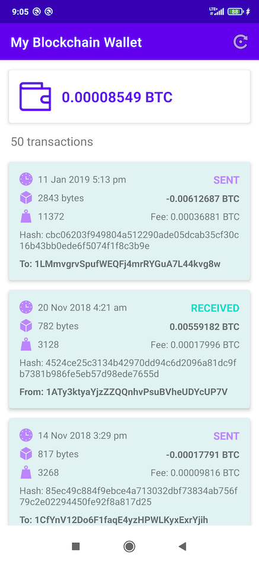
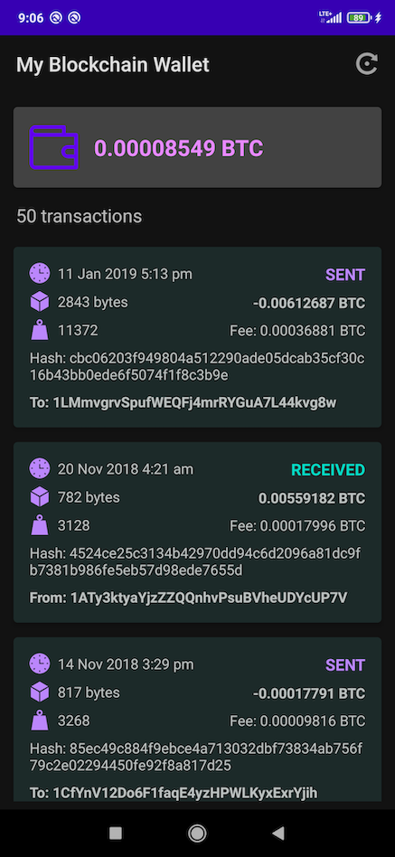
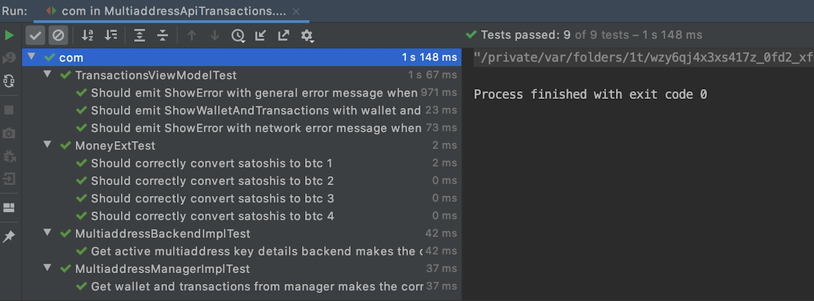
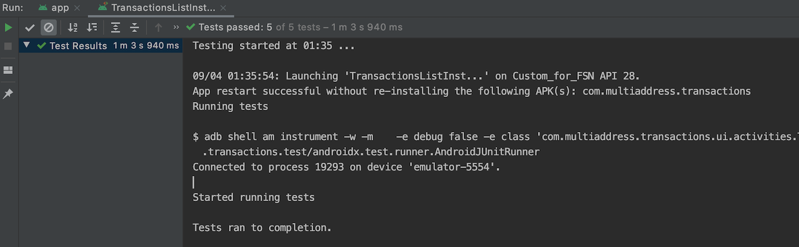

# my-blockchain-wallet
Android project with an example call to Blockchain API and the view with wallet balance plus the list of transactions.
Written in Kotlin, follows MVI design pattern, and uses libraries, such as Retrofit, RxJava, Hilt, Mockito, Espresso and others.

  
  

## Functionality
Contains repos list and repo details fragments. The first one shows the list of trending Android repositories and the second is shown when you click on the item from the list. The list can be refreshed with a toolbar action. The details include repo's title, description, owner's image, stars, open issues, watchers, and forks couts, last update date, main language, license, and readme. Also, GitHub button to go directly to the project (in browser) and Share button - to share repo's link.

## Libraries used:
* AppCompat
* Material
* Retrofit 2
* RxJava 3
* Gson
* Hilt
* Mockito
* Espresso
* Barista
* JUnit

## Tests

### Unit tests
The project incluces unit tests, written with Mockito and JUnit.

### UI tests
The project incluces UI tests, written with Espresso and Barista.

